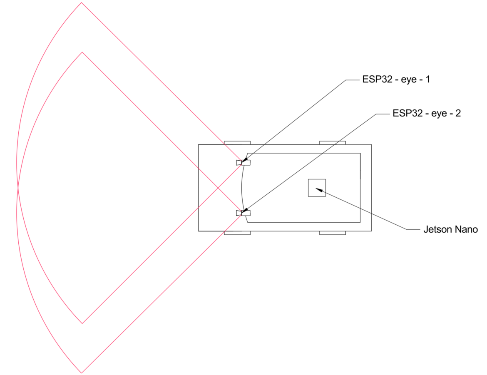
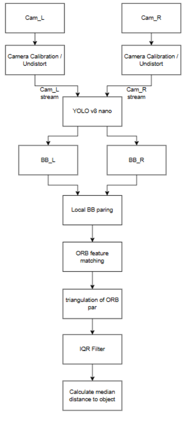

# Object-Centric Convergent Stereo Vision System

A real-time 3D object detection, localization, and depth estimation pipeline using a **convergent dual-camera setup (Convergent Stereo Vision)** powered by an **NVIDIA Jetson Nano** edge computing device.

The main objective of this project is to detect **pedestrians, cyclists, and vehicles**, compute their precise relative 3D coordinates, and project them onto a **2D Bird’s-Eye View (BEV) spatial map** for situational awareness in mobile robotics and autonomous vehicles.

---

## System Layout & Camera Field of View (FOV)

Unlike traditional parallel stereo setups, this system employs **convergent cameras (angled inward)**. This geometry maximizes the overlapping stereo field of view directly in front of the vehicle, drastically reducing the blind spot in close-range scenarios.

  
   
  <em>Figure 1: Top-down diagram illustrating the convergent camera placement, individual FOVs, and the primary symmetric stereo region.</em>

---

## Hardware Architecture

* **Vision Sensors:** $2\times$ ESP32-CAM modules (`Cam_L` and `Cam_R`) streaming video over RTSP/MJPEG over local network.
* **Processing Unit:** NVIDIA Jetson Nano running CUDA-accelerated vision pipelines (YOLO inference, feature matching, triangulation, and rendering).
* **Sensor Orientation:** Fixed inward convergence angle configured to optimize overlap for short-to-mid range detection ($0.5\text{ m} - 10\text{ m}$).

---

## System Processing Pipeline

The following flowchart outlines the end-to-end data processing stream implemented on the Jetson Nano:

  
   
  <em>Figure 2: Complete algorithmic pipeline from raw camera feeds to 2D BEV projection.</em>

---

## Detailed Technical Workflow

### 1. Optical Distortion Correction (`Camera Calibration / Undistort`)
Raw streams from low-cost wide-angle lenses exhibit significant radial and tangential distortion.
* **Intrinsic Parameters:** Using pre-calibrated intrinsic matrices ($K_L, K_R$) and distortion vectors (`dist_L`, `dist_R`), frames undergo spatial rectification before geometric analysis.
* **Geometry Preservation:** Correcting lens distortion ensures straight light ray projections, which is mandatory for valid epipolar geometry and triangulation accuracy.

### 2. Object Detection (`YOLOv8 nano`)
Instead of calculating a dense disparity map for the entire frame (which is computationally expensive), processing power is concentrated strictly on relevant targets.
* The lightweight **YOLOv8 nano** model processes the undistorted streams simultaneously.
* It extracts bounding boxes ($BB_L$ and $BB_R$) for critical traffic classes: **pedestrians**, **bicycles/cyclists**, and **vehicles**.

### 3. Local Epipolar Bounding Box Pairing (`Local BB pairing`)
To match corresponding objects detected by both cameras, the system avoids costly brute-force candidate searching:
* **Search Window Constraint:** Based on physical depth limits ($0.5\text{ m} \le Z \le 10\text{ m}$), a predicted bounding window is computed on the right image relative to the center of $BB_L$.
* **Epipolar Geometry:** Using the pre-calibrated **Fundamental Matrix ($F$)**, the epipolar line $l_R = F \cdot c_L$ is projected onto the right image.
* **Association:** Candidate bounding boxes of the same class located within the search window are evaluated, and the box closest to the epipolar line is selected as the match.

### 4. Feature Extraction & Local Matching (`ORB feature matching`)
Once a pair of bounding boxes ($BB_L, BB_R$) is linked:
* The region of interest (ROI) inside each box is cropped.
* **ORB (Oriented FAST and Rotated BRIEF)** features are extracted within the ROI.
* Feature pairs are matched using a fast Hamming-norm matcher combined with **Lowe's Ratio Test** to drop ambiguous matches.

### 5. 3D Triangulation (`Triangulation of ORB pairs`)
Using the projection matrices $P_L = K_L [I \mid 0]$ and $P_R = K_R [R \mid T]$ obtained via convergent stereo calibration:
* Matched 2D keypoint pairs $(x_L, y_L)$ and $(x_R, y_R)$ are triangulated into a sparse 3D point cloud $(X, Y, Z)$ representing the surface of the detected object.

### 6. Statistical Outlier Removal (`IQR Filter`)
Because rectangular YOLO bounding boxes often contain background elements (e.g., road, walls behind the subject), some points in the 3D cloud belong to the background:
* An **Interquartile Range (IQR)** statistical filter is applied to the depth distribution ($Z$):
  $$Z_{\text{valid}} = \{z \in Z \mid Q_1 - 1.5 \cdot \text{IQR} \le z \le Q_3 + 1.5 \cdot \text{IQR}\}$$
* Points falling outside this range are purged, isolating the physical object's surface points.

### 7. Robust Depth Estimation & BEV Rendering (`Calculate median distance to object`)
1. **Median Distance:** The final metric distance ($Z_{\text{obj}}$) to the object is determined using the **median** value of $Z_{\text{valid}}$, making the output immune to residual false matches.
2. **Bird's-Eye View (2D Map):** Combining the spatial $X$ coordinate (lateral displacement) and $Z$ coordinate (depth distance), the Jetson Nano renders a real-time top-down map showing the vehicle at the origin and surrounding objects marked with their class labels and exact distances in meters.

---
