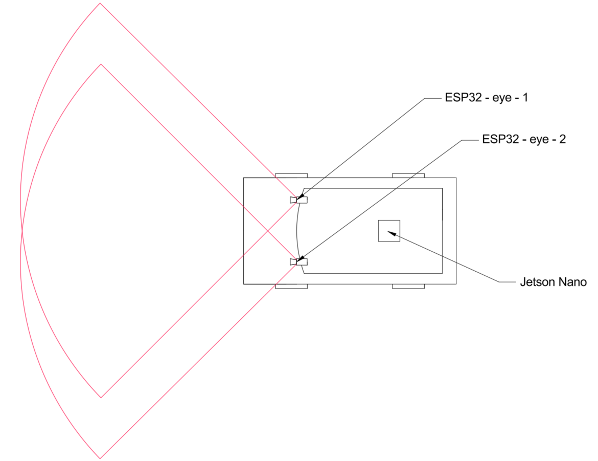

# Object-Centric Stereo Vision System

A stereo-vision pipeline for **object detection, object-level stereo matching, sparse 3D reconstruction, and depth estimation**.

The project is designed as an experimental ADAS / robotics perception system using two cameras and an NVIDIA Jetson Nano as the target edge-computing platform.

The main idea is to avoid dense stereo processing over the entire image. Instead, the system first detects objects with YOLO and then performs stereo correspondence and feature matching **only inside the detected object regions**.

---

## Project Overview

The current pipeline focuses on estimating the depth of detected objects using:

* YOLO-based object detection,
* local bounding-box matching between stereo images,
* ORB feature extraction,
* descriptor matching using Hamming distance,
* Lowe's ratio test,
* RANSAC-based geometric outlier rejection,
* sparse stereo triangulation,
* 3D point sanity checks,
* reprojection-error filtering,
* IQR-based statistical filtering,
* median-based object depth estimation.

The architecture is intentionally **object-centric**: computationally expensive feature matching and triangulation are performed only for regions associated with detected objects.

---

## System Architecture

The current processing pipeline can be summarized as:

```text
              Left Camera                    Right Camera
                   │                              │
                   ▼                              ▼
             YOLO11n detection              YOLO11n detection
                   │                              │
                   ▼                              ▼
              Left BBs                       Right BBs
                   │                              │
                   └──────────┬───────────────────┘
                              ▼
                    BBLeftRightMatcher
                              │
                       Stereo BB pairs
                              │
                              ▼
                       ORB feature matching
                              │
                       Ratio Test + RANSAC
                              │
                              ▼
                       Matched 2D points
                              │
                              ▼
                         Triangulation
                              │
                              ▼
                    3D points (X, Y, Z)
                              │
                    ┌─────────┴─────────┐
                    │                   │
                    ▼                   ▼
               Sanity Check       Reprojection Error
                    │                   │
                    └─────────┬─────────┘
                              ▼
                         Valid Z values
                              │
                              ▼
                            IQR
                              │
                              ▼
                           Median
                              │
                              ▼
                     Object depth estimate
```

---

# Hardware

The original target platform is an NVIDIA Jetson Nano.

### Cameras

The system is designed for a two-camera stereo configuration:

<p align="center">
  
  <br>
  <em>Figure 1: Top-down diagram illustrating the convergent camera placement, individual FOVs, and the primary symmetric stereo region.</em>
</p>

The intended physical configuration uses cameras directed towards the common observation area.

The exact stereo geometry depends on the final camera calibration.

### Processing

The target edge-computing platform is:

* NVIDIA Jetson Nano
* CUDA-enabled OpenCV / ML environment
* Python
* OpenCV
* NumPy
* Ultralytics YOLO

---

# 1. Object Detection

The first stage uses **YOLO11n** to detect objects independently in the left and right images.

Each detection is represented by a `BoxDesc` object containing:

```python
coord
cls
label
conf
```

where:

* `coord` = `[x, y, width, height]`
* `cls` = class name
* `label` = numerical class ID
* `conf` = detection confidence

The detector is implemented in:

```text
src/yoloEval.py
```

The current implementation uses the Ultralytics YOLO interface and returns the detected bounding boxes together with the RGB image.

---

# 2. Local Bounding-Box Stereo Matching

Instead of comparing every left bounding box with every right bounding box without restrictions, the system uses a **local search region**.

The main class responsible for this stage is:

```text
BBLeftRightMatcher
```

implemented in:

```text
src/BBMatcher.py
```

The base `BBMatcher` provides common operations such as:

* bounding-box center calculation,
* bottom-center calculation,
* bounding-box area,
* local search region generation,
* class consistency checks,
* position error,
* relative size error.

The size of the local search region is configurable:

```python
BBLeftRightMatcher(
    local_search_x=1.0,
    local_search_y=0.5
)
```

This makes the search area dependent on the size of the reference bounding box rather than on the whole image.

For every candidate pair, the stereo matcher evaluates:

* vertical position difference,
* bounding-box size difference,
* horizontal disparity,
* image correlation.

The best candidate below the configured matching threshold is selected.

---

# 3. Object Tracking Between Frames

The repository also contains a separate:

```text
FrameMatcher
```

which is responsible for matching detections between consecutive frames:

```text
frame t  →  frame t+1
```

Unlike stereo matching, this matcher is temporal rather than spatially stereo-based.

It uses:

* object class,
* bounding-box position,
* bounding-box size,
* local search region.

Each tracked object receives a persistent:

```text
track_id
```

The tracker also supports temporary disappearance of detections through a configurable `max_age` parameter.

For example:

```python
FrameMatcher(
    threshold=300.0,
    local_search_x=3.0,
    local_search_y=2.0,
    max_age=5
)
```

allows an object to remain in the tracking state for several frames even if YOLO temporarily fails to detect it.

### Current status

The temporal tracking infrastructure is implemented in `BBMatcher.py`, but it is currently separate from the main `ObjectCentricStereo` pipeline.

The intended architecture is:

```text
YOLO
  │
  ├───────────────┐
  ▼               ▼
Left BBs       Right BBs
  │               │
  └───────┬───────┘
          ▼
  BBLeftRightMatcher
          │
          ▼
     Stereo pairs
          │
          ▼
      FrameMatcher
          │
          ▼
       track_id
```

This `track_id` is intended to become the identifier used later by temporal filtering methods such as a Kalman filter.

---

# 4. Object-Centric ORB Matching

After a left/right bounding-box pair has been established, feature matching is performed **inside the bounding boxes**.

The implementation is located in:

```text
src/characteristicPointMatcher.py
```

The system uses:

* ORB,
* Hamming-distance matching,
* KNN descriptor matching,
* Lowe's ratio test.

The ORB detector is configured with up to 1000 features.

The image regions are resized when necessary and lightly sharpened before ORB extraction.

This approach avoids running feature extraction over the entire image.

Instead:

```text
Full image
     │
     ▼
YOLO bounding box
     │
     ▼
      ROI
     │
     ▼
     ORB
```

This is particularly useful for an object-centric stereo system because the background is largely excluded before feature matching.

---

# 5. RANSAC Geometric Filtering

After the initial ORB matching, the matched point pairs are additionally filtered using RANSAC.

When enough correspondences are available, the implementation estimates a Fundamental Matrix from the matched points and removes geometric outliers.

Conceptually:

```text
ORB matches
     │
     ▼
Initial point pairs
     │
     ▼
Fundamental Matrix + RANSAC
     │
     ├── inliers
     │
     └── outliers → rejected
```

This provides an additional geometric filtering stage before triangulation.

---

# 6. Sparse Stereo Triangulation

The surviving corresponding points are triangulated into 3D points.

The triangulation implementation is located in:

```text
src/triangulationCharacteristicsPoint.py
```

For each corresponding pair:

```text
(xL, yL) ↔ (xR, yR)
```

the system calculates:

```text
(X, Y, Z)
```

in the coordinate system of the left camera.

The projection matrices are constructed from the intrinsic camera matrix and the current stereo translation/rotation parameters.

The resulting sparse 3D points represent the geometry reconstructed from the feature correspondences inside the detected object.

---

# 7. 3D Sanity Checks

Not every triangulated point is accepted.

Before using a 3D point, the implementation checks:

* whether the coordinates are finite,
* whether the reconstructed depth is within the configured distance range,
* whether the point is in front of the right camera.

This prevents obviously invalid triangulation results from entering the depth estimation stage.

The currently configured minimum and maximum distances are parameters of `TriangulationPkt`.

---

# 8. Reprojection Error Filtering

A reconstructed 3D point can be projected back into both camera images.

The system calculates:

```text
3D point
   │
   ├── projection → Left image
   │
   └── projection → Right image
```

and compares the projected coordinates with the original ORB observations.

The reprojection errors are:

```text
error_L
error_R
```

A point is rejected if either error exceeds the configured maximum reprojection error.

Therefore, triangulation is not based solely on whether OpenCV successfully returned a 3D point.

The current pipeline is:

```text
ORB correspondence
       ↓
Triangulation
       ↓
3D sanity check
       ↓
Reprojection error
       ↓
Valid 3D point
```

This is an important part of reducing incorrect depth estimates caused by bad feature correspondences.

---

# 9. IQR Statistical Filtering

Even after geometric filtering, the detected bounding box can contain features that do not belong to the physical object.

For example:

```text
       ┌──────────────┐
       │   OBJECT     │
       │  • • • •     │
       │  • • • •     │
       │       ×      │ ← background point
       └──────────────┘
```

The resulting depth values can therefore contain statistical outliers.

The system applies an Interquartile Range filter:

[
IQR = Q_3-Q_1
]

and accepts values satisfying:

[
Q_1-1.5IQR \leq Z \leq Q_3+1.5IQR
]

This stage is implemented directly in the triangulation pipeline.

---

# 10. Robust Object Depth Estimation

After all geometric and statistical filtering stages, the remaining depth values are aggregated using the **median**:

[
Z_{object} = \operatorname{median}(Z_{valid})
]

The median is used instead of the mean because it is less sensitive to remaining incorrect measurements.

The resulting value is stored in:

```python
desc.triangulation_value
```

If no valid 3D points remain, the triangulation value is set to:

```python
None
```

This allows the rest of the system to distinguish between:

```text
valid depth measurement
```

and:

```text
no reliable depth measurement
```

---

# Current Software Architecture

The current source tree contains the following main components:

```text
src/
├── BBMatcher.py
├── characteristicPointMatcher.py
├── objectCentricStereo.py
├── triangulationCharacteristicsPoint.py
├── utils.py
└── yoloEval.py
```

### `yoloEval.py`

YOLO inference and bounding-box representation.

### `BBMatcher.py`

Contains:

* `BBMatcher`
* `BBLeftRightMatcher`
* `FrameMatcher`

and provides spatial and temporal bounding-box association.

### `characteristicPointMatcher.py`

Object-centric ORB feature extraction and matching.

### `triangulationCharacteristicsPoint.py`

3D reconstruction, sanity checks, reprojection filtering, IQR filtering and median depth estimation.

### `objectCentricStereo.py`

High-level object-centric stereo pipeline combining:

```text
YOLO
 ↓
BB matching
 ↓
ORB
 ↓
triangulation
```

### `utils.py`

Visualization and supporting utilities.

---

# Current End-to-End Pipeline

The currently implemented object-centric stereo pipeline can be summarized as:

```text
             LEFT IMAGE                 RIGHT IMAGE
                  │                          │
                  ▼                          ▼
               YOLO11n                    YOLO11n
                  │                          │
                  ▼                          ▼
               Left BBs                   Right BBs
                  │                          │
                  └───────────┬──────────────┘
                              ▼
                    BBLeftRightMatcher
                              │
                              ▼
                         Stereo BB pair
                              │
                              ▼
                         Object ROI
                              │
                              ▼
                            ORB
                              │
                              ▼
                     Ratio Test Matching
                              │
                              ▼
                         RANSAC
                              │
                              ▼
                       Matched Points
                              │
                              ▼
                       Triangulation
                              │
                              ▼
                      3D Sanity Check
                              │
                              ▼
                    Reprojection Error
                              │
                              ▼
                         IQR Filter
                              │
                              ▼
                           Median Z
                              │
                              ▼
                     Object Depth Estimate
```

---

# Example Output

The current test pipeline visualizes detected objects and their estimated depth directly on the left camera image:

```text
car: 5.42 m
person: 3.17 m
truck: 8.61 m
```

Objects for which no reliable triangulation result is available are displayed as:

```text
car: N/A
```

This makes it possible to visually evaluate both object detection and the quality of the stereo depth estimation.

---

# Calibration and Stereo Geometry

The final system is intended to operate with a calibrated stereo camera pair.

The following parameters are important:

* intrinsic camera matrix `K`,
* camera-to-camera translation,
* camera rotation,
* baseline / relative camera pose,
* lens distortion parameters.

The current triangulation implementation uses an explicit intrinsic matrix and stereo translation/rotation parameters.

**Important:** the current source code still uses a simplified stereo geometry in `TriangulationPkt`. The final convergent-camera configuration should use the actual calibrated relative pose of the two cameras rather than the current simplified baseline model.

Therefore, the calibration model is currently an area for further development.

---

# Future Development

The project is still under active development.

The main planned improvements are:

### Temporal tracking

Integrate `FrameMatcher` into the main object-centric stereo pipeline so that every detected object receives a persistent `track_id`.

```text
Object
  ↓
track_id
  ↓
depth history
```

### Kalman filtering

Use one Kalman filter per tracked object:

```text
track_id = 5
      │
      ▼
Kalman filter #5
      │
      ├── measurement available
      │       ↓
      │     update
      │
      └── measurement missing
              ↓
            predict
```

This is particularly useful when stereo triangulation temporarily fails.

### Improved stereo geometry

Replace the simplified projection model with the final calibrated convergent stereo configuration.

### Epipolar constraints

Use calibrated epipolar geometry to further restrict stereo bounding-box and feature correspondence search.

### Better triangulation validation

Potential future checks include:

* stricter reprojection thresholds,
* cheirality checks,
* disparity/depth consistency,
* uncertainty estimation,
* temporal consistency of 3D measurements.

### BEV representation

The final system is intended to provide a Bird's-Eye View representation using the estimated 3D object positions:

```text
             Z
             ↑
             │
       car   │
             │
             │
─────────────┼────────────→ X
           vehicle
```

BEV rendering is a planned stage and is not yet part of the current core implementation.

---

# Project Status

| Component                           | Status                            |
| ----------------------------------- | --------------------------------- |
| YOLO object detection               | Implemented                       |
| Left/right BB detection             | Implemented                       |
| Local stereo BB search              | Implemented                       |
| Stereo BB matching                  | Implemented                       |
| ORB feature extraction              | Implemented                       |
| Hamming descriptor matching         | Implemented                       |
| Lowe ratio test                     | Implemented                       |
| RANSAC filtering                    | Implemented                       |
| Sparse triangulation                | Implemented                       |
| 3D sanity checks                    | Implemented                       |
| Reprojection error                  | Implemented                       |
| IQR filtering                       | Implemented                       |
| Median depth estimation             | Implemented                       |
| Temporal BB tracker                 | Implemented as separate component |
| Persistent `track_id`               | Implemented in `FrameMatcher`     |
| Kalman filtering                    | Implemented                           |
| Full calibrated convergent geometry | Planned / in development          |
| Epipolar BB search                  | Planned                           |
| BEV visualization                   | Planned                           |

---

# Repository

[Poor_ADAS on GitHub](https://github.com/PaprykVegee/Poor_ADAS?utm_source=chatgpt.com)

# Example how it's work

<p align="center">
  
</p>

## License

This project is currently intended as an experimental research/development project for stereo vision, object detection and ADAS-related perception.
